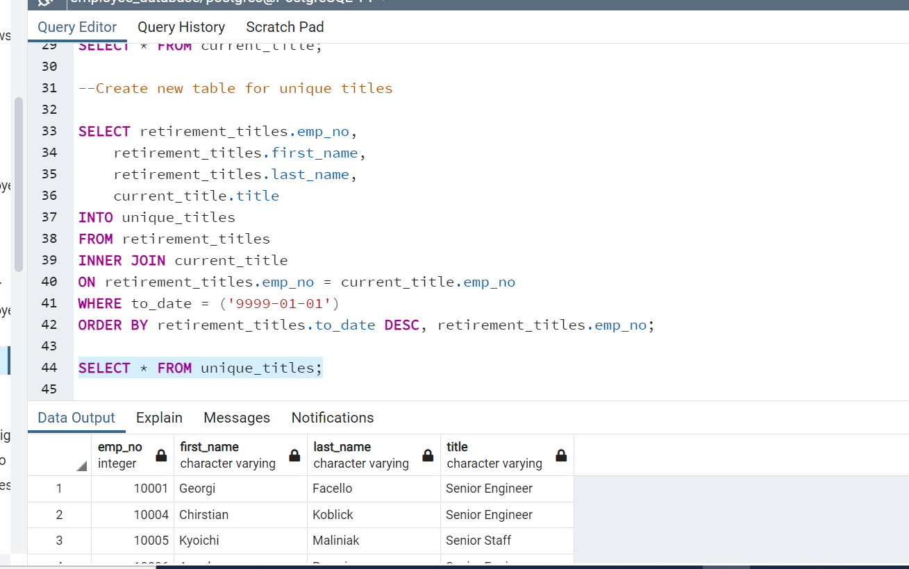
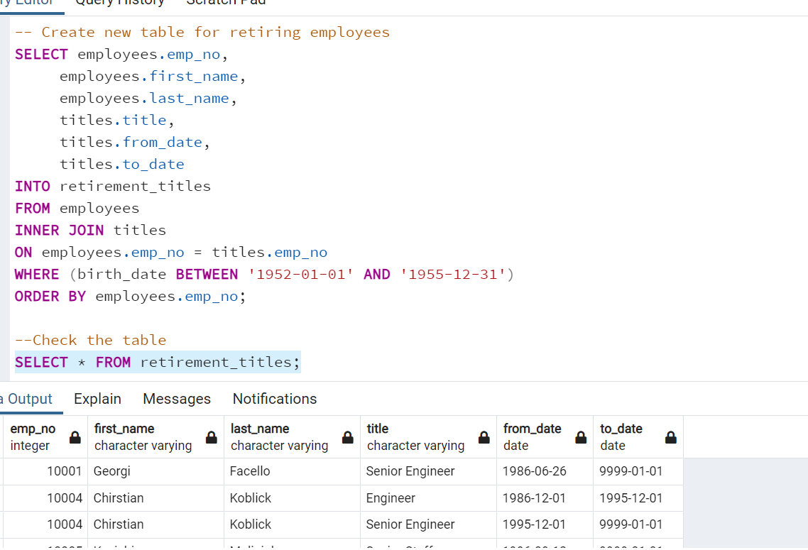

# Pewlett-Hackard-Analysis
Module 7 SQL
## Purpose:
determine the number of retiring employees per title, and identify employees who are eligible to participate in a mentorship program.

# Results:
when analyzinng derivable 1, we can conclude that there are 72498 postions that will be retiring, we also conclude that the number for each title by using the coding showed below

